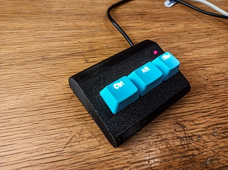

# CADBoard
CTRL-ALT-Del keyboard

## Description

A simple, but full-featured keyboard with just CTRL, ALT and DEL keys. The keys send the correct USB HID codes, and there's a "power light" and three backlight LEDs, all under processor control.

I built mine using the included 3D-printed box design and just soldered everything together in the are, made beautiful with lots of hot glue.

Use a Sparkfun Pro Micro or similar, and Cherry MX keys

May The Source Be With You!
